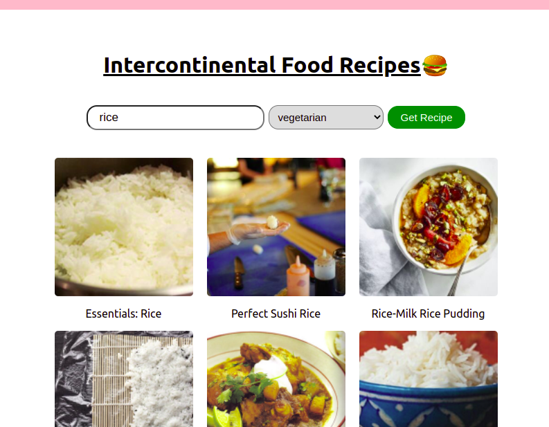

# Intercontinental Food Recipes

This project helps you find recipes for foods from several parts of the world. You specify your taste both in type and health requirements and the food is provided with the recipe.
The project is based on the [edemon](www.edemam.com) api.

The project is hosted on ... checkout the current state of the app

### How to use
- Open the website
- Search food from the search form
- Choose your preference
    the preferences available are:
    'vegetarian', 'alcohol-free',
    'immuno-supportive', 'celery-free', 'crustacean-free',
    'diary-free', 'egg-free', 'fish-free', 'fodmap-free',
    'gluten-free', 'keto-friendly', 'kidney-friendly',
    'kosher', 'low-potassium', 'lupine-free',
    'mustard-free', 'low-fat-abs', 'No-oil-added',
    'low-sugar', 'paleo', 'peanut-free',
    'pecatarian', 'pork-free', 'vegan',
- Click on Get Recipe to get a list of recipes matching your request

### Screenshots

